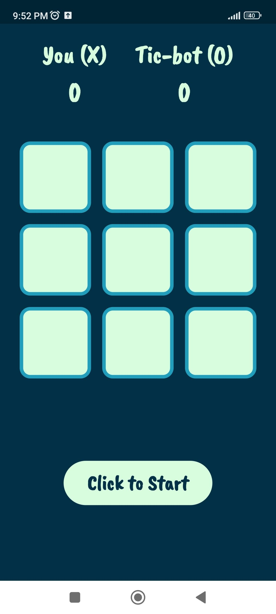
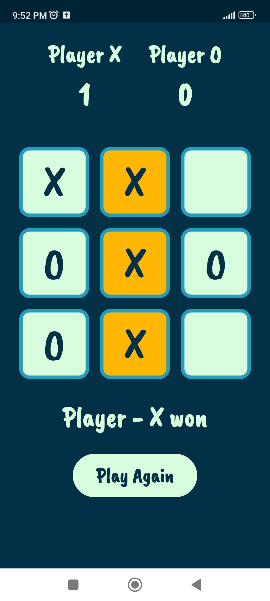

# 🎮 Tic-Tac-Toe AI

A fun and strategic mobile Tic-Tac-Toe game developed using Flutter. The app supports two modes: **Multiplayer** and **Play with AI**. The AI opponent is powered by the Minimax algorithm with Alpha-Beta Pruning, making it a tough opponent to beat!

---

## 🚀 Features

- ✌️ **Multiplayer Mode** – Play with your friends on the same device.
- 🤖 **Play with AI Mode** – Challenge a smart AI that always makes the best move.
- 🧠 AI uses **Minimax with Alpha-Beta Pruning** for optimal and fast decision-making.
- 📱 Smooth UI and animations using Flutter.

---

## 🛠️ Built With

- **AI Logic:** Minimax Algorithm with Alpha-Beta Pruning  
- **Framework:** Flutter  
- **Language:** Dart

---

## 📸 Screenshots

<p align="center">
  
  
  
  
</p>

---

## 🎯 How the AI Works

The AI follows the **Minimax algorithm**, which simulates all possible moves and evaluates the outcome of each game state. It chooses the move that minimizes the opponent’s chance of winning while maximizing its own.

To make the AI efficient, **Alpha-Beta pruning** is applied. This optimization eliminates the need to explore branches of the tree that won’t affect the final decision, making the AI faster and more responsive.

### 🧠 AI Dart Code (Minimax with Alpha-Beta Pruning)

```dart
const String aI = 'O'; // Maximizing player
const String human = 'X'; // Minimizing player
const int negativeInfinite = -9999;
const int infinite = 9999;

int findBestMove(List<String> board) {
  int bestMove = -1;
  int bestValue = negativeInfinite;
  for (int i = 0; i < 9; ++i) {
    if (board[i] == '') {
      board[i] = aI;
      int moveValue = minimax(board, false, negativeInfinite, infinite);
      board[i] = '';

      if (moveValue > bestValue) {
        bestValue = moveValue;
        bestMove = i;
      }
    }
  }
  return bestMove;
}

int minimax(List<String> board, bool isMax, int alpha, int beta) {
  if (checkResult(board, aI)) return 1;
  if (checkResult(board, human)) return -1;
  if (isDraw(board)) return 0;

  if (isMax) {
    int best = negativeInfinite;
    for (int i = 0; i < 9; ++i) {
      if (board[i] == '') {
        board[i] = aI;
        best = max(best, minimax(board, false, alpha, beta));
        board[i] = '';
        alpha = max(alpha, best);
        if (alpha >= beta) break;
      }
    }
    return best;
  } else {
    int best = infinite;
    for (int i = 0; i < 9; ++i) {
      if (board[i] == '') {
        board[i] = human;
        best = min(best, minimax(board, true, alpha, beta));
        board[i] = '';
        beta = min(beta, best);
        if (alpha >= beta) break;
      }
    }
    return best;
  }
}
```
---
### 📄 License
This project is licensed under the **MIT License**.

---

### ⭐ Contribute
I welcome contributions! Feel free to fork the repo and submit pull requests.
